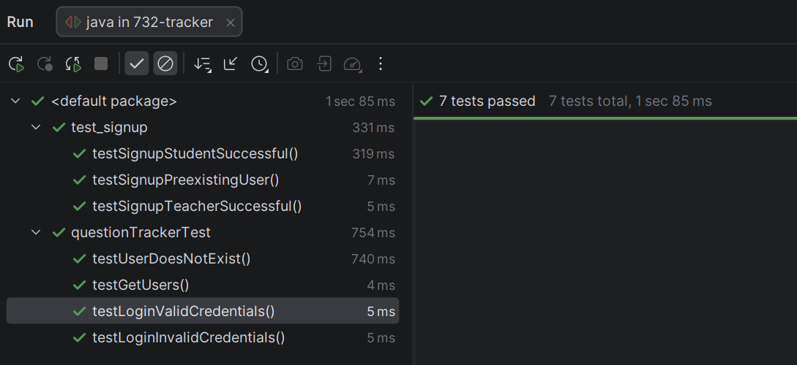

## HW9 First MVP Feature and Tests

### **(1) URL pointing to your test file. In addition to the test code, the test file must include enough comments to help the grader understand your code.**

We did two MVP features rather than one, since both were relatively simple effort wise to 
implement. This way we could have the whole team contributing on the project rather than 
only half the team, or trying to divide up trivial work into even smaller segments(which would 
just make things take longer). 

The two functions we did were login, and signup, both with their own test files. All test functions have sufficient 
docstrings and comments to explain functionality.

Login tests can be found here:
https://github.com/boblord14/swen732-question-tracker/blob/main/src/test/java/questionTrackerTest.java
(note the name for this file is probably going to be refactored in a later sprint, so this file link is subject to change
in a week or two)

Signup tests can be found here:
https://github.com/boblord14/swen732-question-tracker/blob/main/src/test/java/test_signup.java

### **(2) The name of the unit testing framework.**

We used JUnit for our testing, along with mockito to mock a few objects where need be.

### **(3) A screenshot of the test result.**

### **(4) One MVP feature related to your unit test.**

Most of the code functionality related to each feature can be found either here:
https://github.com/boblord14/swen732-question-tracker/blob/main/src/main/java/questionTracker.java
or here: https://github.com/boblord14/swen732-question-tracker/blob/main/src/main/java/user/User.java