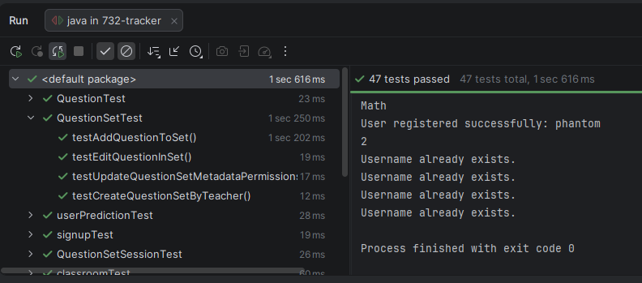

## HW12 All MVP Features and Unit Tests

All MVP features are implemented. The model is complete, the view/controller will be attached in the coming week. 

### (1) URL pointing to your test file. In addition to the test code, the test file must include enough comments to help the grader understand your code.
Test files can be found here:
https://github.com/boblord14/swen732-question-tracker/tree/main/src/test/java

### **(2) The name of the unit testing framework.**

We used JUnit for our testing, along with mockito to mock a few objects where need be.

All 47 tests pass, as can be seen below:

